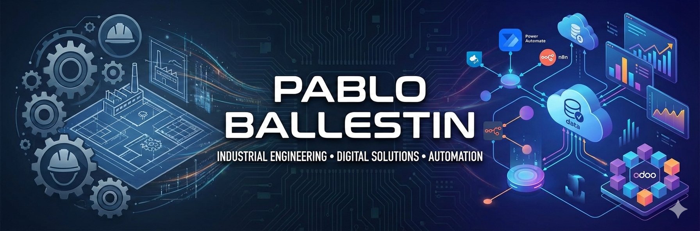

  

    

  

   

  

    
    
  

  

    
    
    
    
    
    
  

  

    <i>I am an Industrial Engineer focused on bridging the gap between physical operations and digital efficiency.   I design and implement data architectures that transform manual chaos into automated, scalable systems.</i>
  

---

<table width="100%">
  <tr>
    <td bgcolor="#f8f9fa">

## 📂 Featured Projects & Systems

### 🏭 End-to-End Digitalization for SMEs
*Integrating specialized developments into a single operational ecosystem for seamless data flow.*

* 📦 **Real-Time Inventory:** Design of stock tracking systems based on the company's data architecture.
* ⚙️ **Process Automation:** Orchestration of workflows via **n8n** and **Power Automate** to increase operational efficiency.
* 🔗 **Integrated Ecosystem:** Implementation of digital tools acting as a nexus between all functionalities, enabling a 360° business view.

### 🧾 Custom Invoice Generator (Power Platform)
*High-performance billing system tailored to complex business logic.*

* ⚡ **Performance:** Generates up to **800 invoices per hour**.
* 🔄 **Automation:** Full data transfer to financial statements and cloud storage (SharePoint/OneDrive).
* ❓ 

### 🤖 Odoo + AI Agent for Smart CRM
*Advanced CRM solution enhanced by Artificial Intelligence for sales operations.*

* 🏗 **Custom CRM:** Fully integrated company CRM within Odoo environment.
* 📊 **AI Insights:** Intelligent agent connected to Excel data to predict trends and detect inactive customers.

    </td>
  </tr>
</table>

---

## 🚀 Impact & Key Results

| Metric | Result |
| :--- | :--- |
| ⏱️ **Billing Efficiency** |  |
| 📦 **Stock Traceability** |  |
| ⚡ **Response Speed** |  |
| 🛠️ **Human Error** |  |

---

  <i>Industrial Engineer | Process Optimizer | Digital Transformation Specialist</i>

